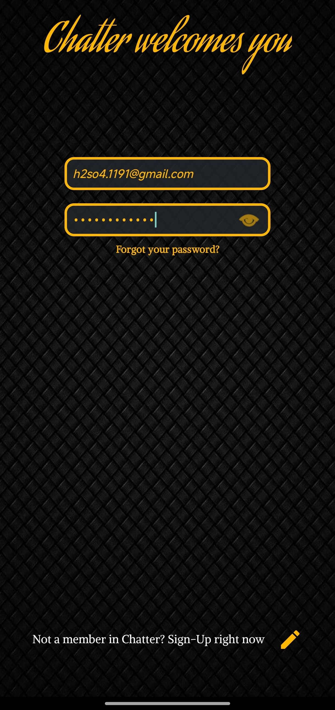
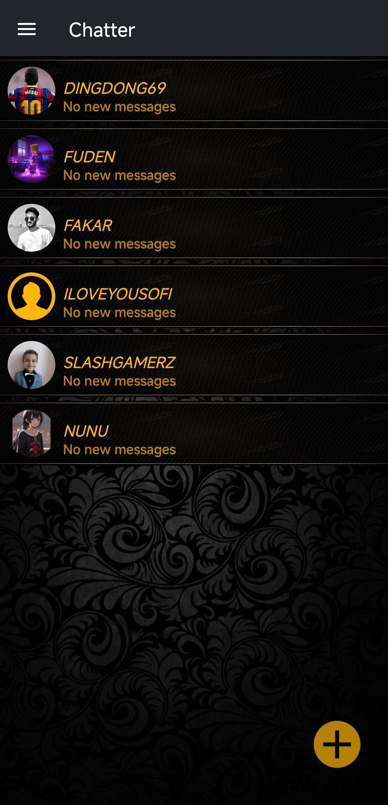
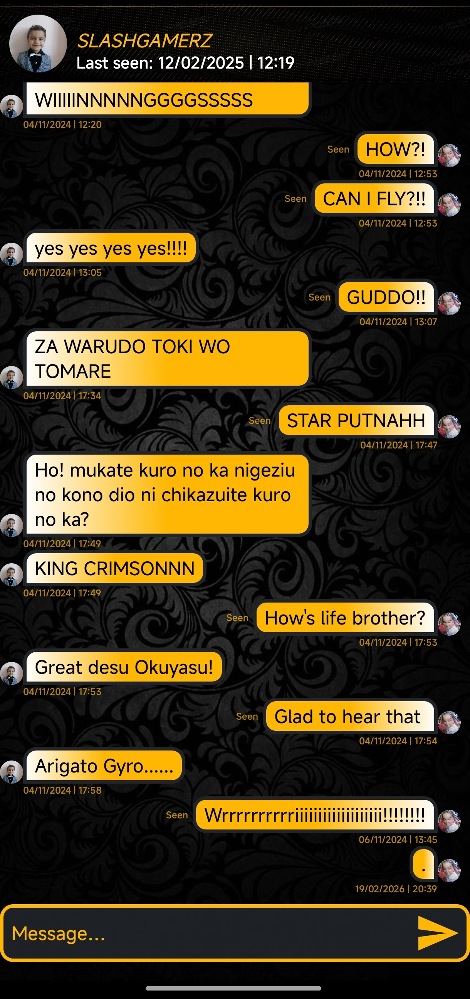
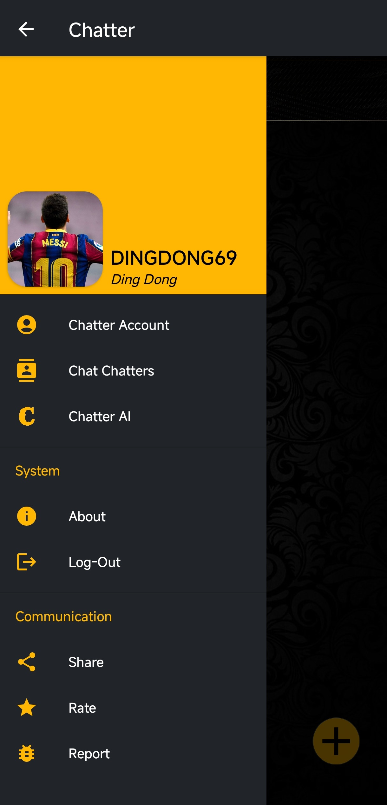

# Chatter

A feature-rich, native Android real-time messaging application designed with a sleek premium interface, integrated AI chatbot helper capabilities, and backend notification orchestration.

## Overview

**Chatter** is a full-stack communications workspace engineered with an Android native client frontend paired alongside a Node.js push proxy backend. The application features an elegant dark gold textured theme interface delivering instant real-time conversations, live contact discovery lists, an integrated automated AI chat companion, and seamless device-level background event dispatching via Firebase.

## Features

- **Real-Time Communication Pipeline:** Instant bidirectional dialogue message interfaces with message delivery statuses, active contact badges, and custom message rendering bubbles.
- **Integrated Chatter AI:** An inline automated smart assistant module (`Chatter AI`) capable of processing user contextual intents natively within the platform interface.
- **Dynamic Contact Discovery:** Live server-side filtering indexes allowing users to query, search, and dynamically locate active chatters across the network pool.
- **Firebase Push Notification Proxy:** Powered by a clean Node.js Express server to handle cross-device background alerts (`/sendNotification`) using the Firebase Admin SDK token delivery pipeline.
- **Secure Authentication Access:** Dedicated gateway forms with field validation, hidden input visibility toggles, and customized credential matching profiles.
- **Premium Textured UI Experience:** Stylized custom assets including particle splash screens, deep textured geometric backgrounds, and synchronized branding palettes.

## Tech Stack

- **Frontend Client:** Android Native (Kotlin / XML View Architectures)
- **Backend Service Proxy:** Node.js, Express, Body-Parser (or native Express routing)
- **Cloud Notification Layer:** Firebase Admin SDK (Cloud Messaging API)
- **Build Core Configuration:** Gradle (Kotlin DSL - `.gradle.kts`)

## Project Structure

```bash
chatter/
├── app/                       # Native Android client module code (Java/Kotlin source, XML layouts)
├── backend/                   # Node.js communication proxy and server push routes
│   ├── index.js               # Clean Firebase notification service endpoint controller
│   ├── package.json           # Backend runtime node package tracking configurations
│   └── firebase-service-account.json # (Git Ignored) Private Admin SDK cloud credential layer
├── screenshots/               # Production interface assets used for documentation
│   ├── chat.jpg               # Live conversation view module
│   ├── chatters-list.jpg      # Contact discovery interface component
│   ├── login.jpg              # Secure validation authorization page
│   ├── menu.jpg               # Interactive slide drawer navigation panel
│   └── splash.jpg             # Particle particle landing splash graphics asset
├── .gitignore                 # Top-level isolation filters targeting local files and keys
├── build.gradle.kts           # Global project compilation scripts
├── gradle.properties          # Studio environmental build configurations
├── gradlew                    # Linux/macOS engine wrapper script
├── gradlew.bat                # Windows engine automation script
├── README.md                  # Comprehensive workspace portfolio documentation
└── settings.gradle.kts        # Root module mapping indices
```

## Application Interface Mappings

### Gateway Security & Splash Design

 

_Figure 1: Custom particle visual splash architecture alongside secure encrypted account authorization views._

### Core Chat Spaces & Contact Discovery

  

_Figure 2: Real-time chatter index feeds, bidirectional dialogue screens with active message threads, and central modular control drawers._

## Setup & Running Environments

### Backend Setup

1. Open your terminal workspace inside the `backend/` path directory.
2. Download your private credential file from your Firebase Project console, drop it into the folder, and name it `firebase-service-account.json`.
3. Install package variables and kickstart the notification proxy server pipeline:
   ```bash
   npm install
   node index.js
   ```

### Frontend Android Setup

1. Launch Android Studio and open the parent root `chatter/` workspace directory location.
2. Provide your target application client setup file (`google-services.json`) inside the `/app` folder.
3. Allow the project build configurations to fully synchronize with your local Gradle system wrapper engine.
4. Execute `Shift + F10` or launch your target physical test device to deploy the messaging app structure.

## Download & Installation

To run the application instantly without manual source code compilation, download the latest pre-compiled build:

[](https://mega.nz/file/06xhSKIZ#ZCr7B9Gy6NGNoxVYp9RqYcFBYUBrJxCVljEhpeUZgII)

> **Note:** Because this application binary is distributed directly as an independent package outside the Google Play Store, your Android operating system will flag it as an "Unknown App." You will need to toggle **"Allow installation from unknown sources"** in your device security settings to complete the setup.

## Author

H2SO4-1191 – Software Engineer
